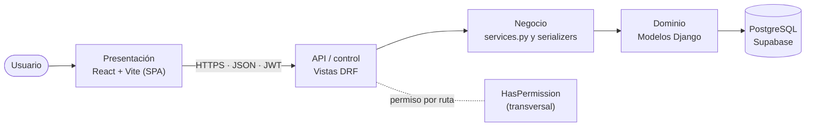
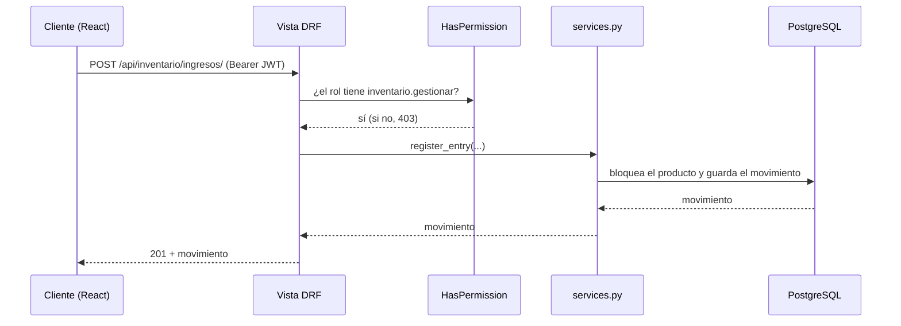

# Arquitectura

TexCore usa una **arquitectura por capas** (cliente-servidor en N capas). El backend sigue el patrón
de Django, MVT, que se parece a MVC; por eso conviene describir el sistema completo como capas.

## Vista general



| Capa | Dónde está | Responsabilidad |
|---|---|---|
| Presentación | Repositorio `TexCoreERP-Frontend` (`src/components`, `src/auth`, `src/api`) | Pantallas y formularios. No decide reglas de negocio. |
| API / control | `apps/*/views.py`, `apps/*/urls.py` | Recibe la petición, comprueba el permiso y delega. |
| Negocio | `apps/inventory/services.py`, `apps/users/password_reset.py`, serializers | Reglas: stock suficiente, cantidades, NIT, composición textil, delegación de roles. |
| Dominio | `apps/*/models.py` | Entidades y restricciones de datos. |
| Persistencia | ORM de Django → PostgreSQL (Supabase) | Almacenamiento. |

### Por qué capas y no MVC "a secas"

- Django es **MVT** (Model, View, Template): su *View* hace de controlador. Aquí la plantilla la sustituye
  una SPA de React que es un proyecto aparte, así que MVC solo describe una parte del sistema.
- Cada capa se cambia y se prueba sin tocar las demás: las 142 pruebas del backend no dependen de la interfaz.
- Permite repartir el trabajo (frontend y backend) y cumple el requisito de arquitectura modular (RNF09):
  `users`, `inventory` y `core` son módulos independientes y los siguientes se añaden igual.

Correspondencia con el modelo de análisis (interfaz / control / entidad):

| Modelo de análisis | En el código |
|---|---|
| Clase interfaz | Componentes React, por ejemplo `Login.jsx` |
| Clase control | Vista DRF + serializer o servicio |
| Clase entidad | Modelo Django, por ejemplo `CustomUser`, `Producto` |

## Estructura del backend

```
backend/
├── config/        # settings, urls, wsgi/asgi
├── apps/
│   ├── core/      # salud, BaseModel (borrado lógico), permiso HasPermission, comando generar_erd
│   ├── users/     # usuarios, roles y permisos, recuperación de contraseña
│   └── inventory/ # proveedores, catálogo, órdenes, kardex, evidencias, alertas
└── docs/          # esta documentación
```

Cada app separa sus responsabilidades en `models.py`, `serializers.py`, `views.py`, `urls.py` y,
cuando hay reglas de negocio, `services.py`.

## Flujo de una petición



Las reglas de negocio fallan con un error 400 `{campo: [mensaje]}` que la interfaz muestra junto al campo.

## Seguridad

- **Autenticación JWT** (simplejwt): `access` de 15 minutos y `refresh` rotativo de 30 minutos, así la sesión vence
  tras 30 minutos sin uso. Cambiar la contraseña invalida las sesiones abiertas.
- **Permiso por ruta** (RNF01): `HasPermission` es el permiso por defecto de toda la API. Cada vista declara
  `required_permissions`; una vista sin declararlo queda **cerrada** (falla cerrado). Las rutas públicas
  (login, registro, recuperación, salud) lo declaran explícitamente.
- **RBAC**: los roles tienen permisos `<modulo>.ver` y `<modulo>.gestionar`; `ADMIN` los tiene todos.
- **Delegación segura**: quien gestiona usuarios sin ser administrador no puede crear administradores
  ni asignar roles con permisos de Seguridad (corrección del BUG-01 de QA).
- **Límites de frecuencia**: login 10/min por IP; registro 20/hora; recuperación 5/hora por IP y 3 correos/hora por usuario.
- **Base de datos**: después de cada migración se activa RLS sin privilegios para los roles de la API de Supabase.

## Decisiones de diseño

| Decisión | Motivo |
|---|---|
| Borrado lógico (`deleted_at`) en todas las tablas de negocio | Conservar el historial y la trazabilidad (ver [convenciones](convenciones-base-de-datos.md)). |
| El stock solo cambia con movimientos (kardex) | Cada cambio queda con saldo antes y después, usuario y fecha. |
| Código consecutivo por categoría (`TEL-0001`, `OP-0002`...) | Identificadores legibles y únicos, generados dentro de una transacción. |
| Imagen de referencia del producto guardada en la base | El disco de Render es efímero; en la base no se pierde. Se sirve con sesión y `ETag`. |
| Tipo de archivo decidido por su contenido (firma binaria) | No confiar en el nombre ni en el tipo que declare el navegador. |
| Metadatos del catálogo servidos por la API (`/api/inventario/metadatos/`) | El frontend no duplica categorías, unidades ni reglas. |

!!! warning "Limitaciones conocidas"
    - Las evidencias (foto o PDF) se guardan en el disco del servicio y se pierden al redesplegar en Render (plan gratuito).
    - El bloqueo de cuenta al tercer intento fallido (RF01) y un registro de auditoría general (RNF02) están pendientes.
    - Desarrollo y producción comparten hoy la misma base de datos.
