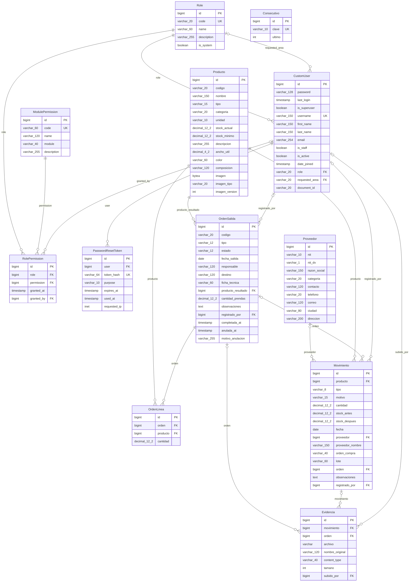

# Modelo de datos

> Generado automáticamente con `python manage.py generar_erd --salida docs/modelo-de-datos.md`.
> No lo edites a mano: vuelve a generarlo cuando cambie un modelo.

Todas las tablas de negocio heredan de `BaseModel` y por eso incluyen además `created_at`, `updated_at` y `deleted_at` (borrado lógico; ver [convenciones de base de datos](convenciones-base-de-datos.md)). Esas columnas no se repiten abajo.

## Diagrama entidad-relación

## Tablas

### ModulePermission (`seguridad_permiso`)

Acción concreta sobre un módulo, p. ej. "inventario.gestionar".

| Campo | Tipo | Restricciones | Relación |
|---|---|---|---|
| `id` | bigint | PK |  |
| `code` | varchar(60) | UK |  |
| `name` | varchar(120) |  |  |
| `module` | varchar(40) |  |  |
| `description` | varchar(255) |  |  |

### Role (`seguridad_rol`)

Perfil de acceso. El código es inmutable: lo usan el JWT y el frontend.

| Campo | Tipo | Restricciones | Relación |
|---|---|---|---|
| `id` | bigint | PK |  |
| `code` | varchar(20) | UK |  |
| `name` | varchar(60) |  |  |
| `description` | varchar(255) |  |  |
| `is_system` | boolean |  |  |

### RolePermission (`seguridad_rol_permiso`)

Asignación de un permiso a un rol (tabla intermedia), con quién y cuándo lo concedió.

| Campo | Tipo | Restricciones | Relación |
|---|---|---|---|
| `id` | bigint | PK |  |
| `role` | bigint | FK | → `Role` |
| `permission` | bigint | FK | → `ModulePermission` |
| `granted_at` | timestamp |  |  |
| `granted_by` | bigint | FK, nulo | → `CustomUser` |

### CustomUser (`users_customuser`)

Usuario del sistema. El correo es también el `username`; el rol decide los permisos (RBAC).

| Campo | Tipo | Restricciones | Relación |
|---|---|---|---|
| `id` | bigint | PK |  |
| `password` | varchar(128) |  |  |
| `last_login` | timestamp | nulo |  |
| `is_superuser` | boolean |  |  |
| `username` | varchar(150) | UK |  |
| `first_name` | varchar(150) |  |  |
| `last_name` | varchar(150) |  |  |
| `email` | varchar(254) |  |  |
| `is_staff` | boolean |  |  |
| `is_active` | boolean |  |  |
| `date_joined` | timestamp |  |  |
| `role` | varchar(20) | FK | → `Role` |
| `requested_area` | varchar(20) | FK, nulo | → `Role` |
| `document_id` | varchar(20) | nulo |  |

### PasswordResetToken (`seguridad_token_recuperacion`)

Token de un solo uso para restablecer o definir la contraseña (HU 1.3).

| Campo | Tipo | Restricciones | Relación |
|---|---|---|---|
| `id` | bigint | PK |  |
| `user` | bigint | FK | → `CustomUser` |
| `token_hash` | varchar(64) | UK |  |
| `purpose` | varchar(10) |  |  |
| `expires_at` | timestamp |  |  |
| `used_at` | timestamp | nulo |  |
| `requested_ip` | inet | nulo |  |

### Consecutivo (`inventario_consecutivo`)

Último número usado por cada prefijo (OP, LV, MP...). Se bloquea al asignar.

| Campo | Tipo | Restricciones | Relación |
|---|---|---|---|
| `id` | bigint | PK |  |
| `clave` | varchar(10) | UK |  |
| `ultimo` | int |  |  |

### Proveedor (`inventario_proveedor`)

Proveedor de telas e insumos (HU 2.1). El NIT es único entre los proveedores activos.

| Campo | Tipo | Restricciones | Relación |
|---|---|---|---|
| `id` | bigint | PK |  |
| `nit` | varchar(10) |  |  |
| `nit_dv` | varchar(1) |  |  |
| `razon_social` | varchar(150) |  |  |
| `categoria` | varchar(20) |  |  |
| `contacto` | varchar(120) |  |  |
| `telefono` | varchar(20) |  |  |
| `correo` | varchar(120) |  |  |
| `ciudad` | varchar(80) |  |  |
| `direccion` | varchar(200) |  |  |

### Producto (`inventario_producto`)

Producto del catálogo (HU 2.2): materia prima, insumo, pantalón genérico o terminado.

| Campo | Tipo | Restricciones | Relación |
|---|---|---|---|
| `id` | bigint | PK |  |
| `codigo` | varchar(20) |  |  |
| `nombre` | varchar(150) |  |  |
| `tipo` | varchar(15) |  |  |
| `categoria` | varchar(20) |  |  |
| `unidad` | varchar(10) |  |  |
| `stock_actual` | decimal(12,2) |  |  |
| `stock_minimo` | decimal(12,2) |  |  |
| `descripcion` | varchar(255) |  |  |
| `ancho_util` | decimal(4,2) | nulo |  |
| `color` | varchar(60) |  |  |
| `composicion` | varchar(120) |  |  |
| `imagen` | bytea | nulo |  |
| `imagen_tipo` | varchar(20) |  |  |
| `imagen_version` | int |  |  |

### OrdenSalida (`inventario_orden`)

Orden de producción (OP) o de lavandería (LV) que saca materiales del almacén (HU 2.3).

| Campo | Tipo | Restricciones | Relación |
|---|---|---|---|
| `id` | bigint | PK |  |
| `codigo` | varchar(20) |  |  |
| `tipo` | varchar(12) |  |  |
| `estado` | varchar(12) |  |  |
| `fecha_salida` | date |  |  |
| `responsable` | varchar(120) |  |  |
| `destino` | varchar(120) |  |  |
| `ficha_tecnica` | varchar(60) |  |  |
| `producto_resultado` | bigint | FK | → `Producto` |
| `cantidad_prendas` | decimal(12,2) | nulo |  |
| `observaciones` | text |  |  |
| `registrado_por` | bigint | FK, nulo | → `CustomUser` |
| `completada_at` | timestamp | nulo |  |
| `anulada_at` | timestamp | nulo |  |
| `motivo_anulacion` | varchar(255) |  |  |

### OrdenLinea (`inventario_orden_linea`)

Línea de la cesta de una orden: un producto y la cantidad que sale.

| Campo | Tipo | Restricciones | Relación |
|---|---|---|---|
| `id` | bigint | PK |  |
| `orden` | bigint | FK | → `OrdenSalida` |
| `producto` | bigint | FK | → `Producto` |
| `cantidad` | decimal(12,2) |  |  |

### Movimiento (`inventario_movimiento`)

Fila del kardex: cada ingreso o salida con el saldo antes y después, el usuario y la fecha.

| Campo | Tipo | Restricciones | Relación |
|---|---|---|---|
| `id` | bigint | PK |  |
| `producto` | bigint | FK | → `Producto` |
| `tipo` | varchar(8) |  |  |
| `motivo` | varchar(15) |  |  |
| `cantidad` | decimal(12,2) |  |  |
| `stock_antes` | decimal(12,2) |  |  |
| `stock_despues` | decimal(12,2) |  |  |
| `fecha` | date |  |  |
| `proveedor` | bigint | FK, nulo | → `Proveedor` |
| `proveedor_nombre` | varchar(150) |  |  |
| `orden_compra` | varchar(40) |  |  |
| `lote` | varchar(60) |  |  |
| `orden` | bigint | FK, nulo | → `OrdenSalida` |
| `observaciones` | text |  |  |
| `registrado_por` | bigint | FK, nulo | → `CustomUser` |

### Evidencia (`inventario_evidencia`)

Foto o PDF adjunto a un movimiento o a una orden.

| Campo | Tipo | Restricciones | Relación |
|---|---|---|---|
| `id` | bigint | PK |  |
| `movimiento` | bigint | FK, nulo | → `Movimiento` |
| `orden` | bigint | FK, nulo | → `OrdenSalida` |
| `archivo` | varchar |  |  |
| `nombre_original` | varchar(120) |  |  |
| `content_type` | varchar(40) |  |  |
| `tamano` | int |  |  |
| `subido_por` | bigint | FK, nulo | → `CustomUser` |
